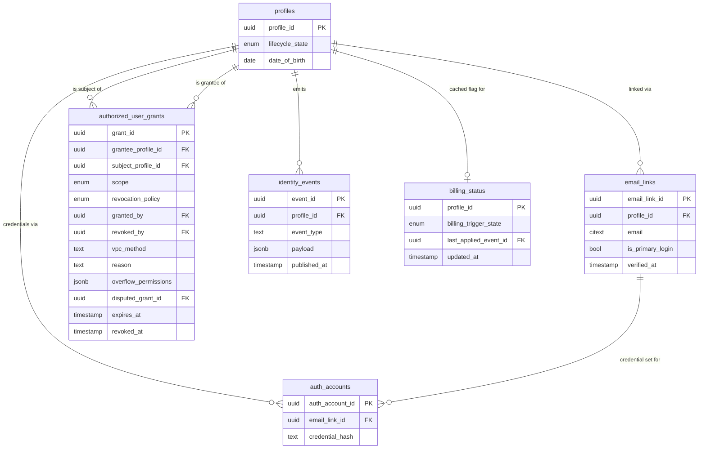
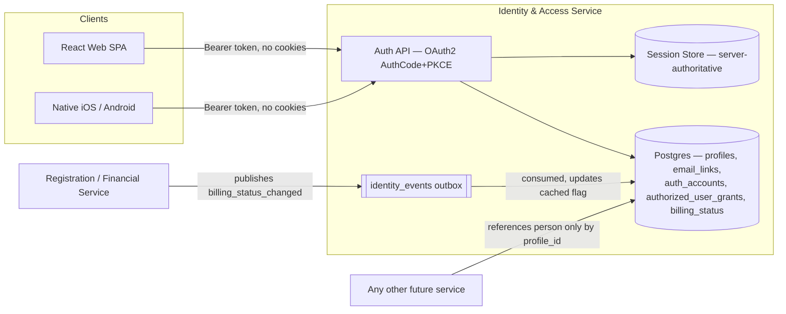
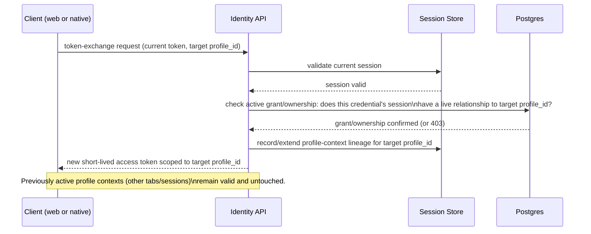

**# Identity & Profile Architecture

**FINAL — this is the approved version, revised in place by Step 6 (Architecture Review) against the draft Step 5 produced.** Guidelines-level architecture for a future implementable module ("Module 1: Identity & Access Service"). This is the file that module needs to read — data model, API contract shape, profile-switcher contract, billing hook, and the invariants a builder must not violate. It does **not** contain an OpenAPI spec, database migrations, epics, or stories — those are Module 1's own, later, separate Spec Track.

Full provenance, rationale, and the underlying build-substrate spine (with stable `AD-n` decision IDs for future citation) live at `_bmad-output/planning-artifacts/architecture/architecture-isportz-2026-08-31-identity/ARCHITECTURE-SPINE.md` and its `.memlog.md`. This document restates those decisions in narrative form against the four things this chain's Step 5 asked for, plus the invariants that hold it all together.

## Design paradigm

**Profile-centric normalized relational domain, with server-authoritative session state.** `profile_id` is the one durable identity every other table, service, and token may reference — email, credentials, grants, session, and billing status are all satellite relations hanging off it, never substitute keys. Session/authorization *authority* lives server-side; any token issued to a client is short-lived and derived, never the source of truth.

## 1. Data model / ERD

**The `profile_id` foreign-key contract**: any table or event schema *external to Identity* that needs to reference a person stores `profile_id` (UUID) and nothing else as the join key — no external table stores email, a username, or any other value as a substitute identity key. `profiles` itself carries no email column at all; email lives one layer out in `email_links`, structurally enforcing the FRD's PK-purity rule rather than relying on convention. (One narrow, Identity-internal exception: a credential-security operation — "force re-auth because this specific login was compromised" — legitimately keys on `auth_account_id`/`email_link_id`, since one profile can have more than one. That operation lives entirely inside Identity's own boundary; it is never a key any other service needs or receives.)

**Schema pattern**: normalized multi-table, not JSONB-embedded emails (`email_links.email` is a B-tree-indexed relational column, partial-indexed on active rows) — the login-path query is a pure equality-filter lookup, and JSONB/GIN carries documented planner-misestimation and bitmap-scan costs for exactly this access pattern (technical-research.md Dimension 1). The one narrow, named exception is `authorized_user_grants.overflow_permissions` — edge-case *permission* metadata no service branches its authorization logic on, never identity/email/credential data.

**Email uniqueness is per-link, never global**: uniqueness is enforced only on `(email, profile_id)` (or narrower, e.g. `is_primary_login` partial-unique per email) — the same email string may legitimately resolve to more than one independent `profile_id`. The login-path query always returns a *set* of profiles, never assumes cardinality one.

**The disambiguating rule — which mechanism governs which use case.** Two mechanisms exist in this model (`email_links` plurality, and `authorized_user_grants`), and they are never interchangeable for the same relationship:

- **`email_links` links a profile only to a person who directly controls it** — self-registration or self-claim. A profile only ever gains an `email_links` row for its own owner.
- **A guardian's access to a *different* profile (a dependent's) is always and only an `authorized_user_grants` row — never an additional `email_links` row on the dependent's profile.**

Applied to the five use cases:
- **Parent, multiple children:** the parent has exactly one profile of their own, with their email in `email_links` as usual. Each child has their own profile, created with zero `email_links` rows. The parent reaches each child via a `full_guardian` grant (`grantee_profile_id` = parent, `subject_profile_id` = child) — one grant row per child, not a shared email row.
- **Divorced/co-parenting:** each parent has their own profile and their own `email_links` row (their own login). Each independently holds a `full_guardian` grant on the same child `subject_profile_id` — two grants, one subject, no shared credential.
- **Shared family email, two independent adults:** this is the *only* case `email_links` plurality actually serves — the same email string appears in two separate `email_links` rows, each pointing directly at a different adult's own profile (peers, not a guardian relationship).
- **Adult participant:** one profile, one `email_links` row, zero grants required.
- **Minor aging into adulthood:** the child's profile has zero `email_links` rows throughout minority (the guardian's access was always via grant, never a shared email row) — so majority doesn't "break off" an existing row, it simply adds the profile's *first* `email_links` row, tied to the now-adult's own credential. No row is retired, migrated, or reassigned.

**Login resolution, corrected accordingly:** the login-path query is a single indexed `UNION` — the caller's own profile(s) via `email_links` (by email), **UNION** any profile where an active grant names one of those profiles as `grantee_profile_id` — returning `profile_id`, `lifecycle_state`, `display_name` for the full switchable set (own profiles *and* dependents) in one covering query, not two round trips. This is what makes "one email, multiple children" and "co-parenting" resolve to a complete picker list without a second lookup, while keeping `email_links` itself scoped only to direct ownership.

**Authorized-user grants**: access from one profile to another's data is expressed only as a row in `authorized_user_grants` — never a duplicate/shadow profile for the grantee. A `CHECK` constraint forbids `grantee_profile_id = subject_profile_id`. Grants are insert-only and soft-revoked (`revoked_at`/`revoked_by` set, never deleted) — the audit trail COPPA's unilateral-guardian-revocation model requires, plus the `revoked_by` and `vpc_method` fields domain research surfaced as a genuine gap in the original brainstormed schema.

- **Scope is an unordered, exhaustively-enumerated value** (`view`, `edit`, `full_guardian`, `disputed`) — never a numeric hierarchy. Permission matrix: `view` = read `profiles` fields only; `edit` = read + write mutable `profiles` fields (name, contact prefs), **excludes** `email_links`/`auth_accounts` mutation; `full_guardian` = `edit` plus create/revoke `email_links` and other grants on the subject; `disputed` = read-only on the contested grant. A new scope value is added only by extending this contract explicitly — never by encoding an unreviewed permission into `overflow_permissions`.
- **Revocation authorization is a separate axis from scope, via `revocation_policy`** (`standard` | `protected`): under `standard` (the default), any grantee currently holding an active `full_guardian` grant on the same subject may revoke *any* `standard` grant on that subject; the original `granted_by` may always revoke their own grant; the subject may revoke any grant on themself once adult. A `protected` grant (e.g. a court-appointed temporary guardian during a custody dispute) may be revoked only by the party or process named in `reason`/`vpc_method` (a court order reference), never by another guardian's unilateral `full_guardian` action — this decouples "how much access" (`scope`) from "who can take it away" (`revocation_policy`) so a new relationship type with different revocation rules never requires a schema change, only a new row using the existing two independent enums. No other profile may set `revoked_by` under either policy.
- **Dispute**: recorded as a new grant row on the same `subject_profile_id`, with `disputed_grant_id` pointing at the contested grant and `scope='disputed'`; any mirrored `identity_events` row uses the **subject's** `profile_id`, never the disputing guardian's, so "all disputes concerning child X" is always `profile_id = X`. The tie-break *policy* (whose dispute prevails) is a legal/product decision left open (domain-research.md); this storage shape and query key are not.
- Either guardian acts — grants, revokes, or disputes — without requiring the other guardian's cooperation, matching real precedent (MyChart, Google Classroom) rather than Apple Family Sharing/Amazon Family's single-owner model, which cannot serve the co-parenting use case at all. **Bootstrap without cooperation:** a second guardian who was never invited by the first establishes their own grant via an independent verified-custody claim (the same VPC-style verification used at initial registration), not an invite/accept round-trip through the first guardian — this is what makes "without requiring the other's cooperation" true from the very first grant, not only after both already hold one.
- A batch relationship (e.g. a team manager acting for an entire squad of profiles) is expressed as N individual grant rows, one per squad member, with no new table or column required; a batch create/revoke *operation* (act on all of a manager's grants for a given roster in one call) is an API-level convenience layered on top of this shape, deferred to Module 1's spec — not a schema gap.

**Minor-to-adult transition**: `lifecycle_state` is an enum column on `profiles`, flipped by a single `UPDATE` — `profile_id` never changes, and no new *profile* record is created. `is_adult` is a generated/computed value from `date_of_birth`, not a batch job, so the transition is passive/pull-triggered at the next login. Per the disambiguating rule above, the child's profile had zero `email_links` rows before this point (the guardian's access was always via grant, never a shared email row), so majority adds the profile's first `email_links` row — an expected insert, not a migration of any existing row. The guardian's grant is neither auto-deleted nor silently modified — it defaults to retained, per the FRD's own wording, until explicitly revoked or re-consented.

**Billing-trigger hook**: `billing_status` is its own satellite table (`profile_id` PK/FK, `billing_trigger_state`, `last_applied_event_id`) — not a column on `profiles` — consistent with every other cross-domain concern in this model being a satellite relation, not an inline field on the core aggregate. It is cached and read-only, populated only by consuming an event a Registration/Financial service publishes into the append-only `identity_events` outbox (`profile_id`, `event_type`, `payload`, `published_at`). Consumption is idempotent (dedupe by `event_id`, tracked via `last_applied_event_id`) and ordered (apply only if `published_at` is newer than the last-applied event for that `profile_id`). No API path, including administrative tooling, may write this table directly — a support override is only ever a synthetic replay of a Financial-originated event. Identity never makes a synchronous call to a billing service and never decides paid-registration semantics itself. Keeping it a satellite table, not a `profiles` column, also means Financial's billing-state model can evolve (new tiers, concurrent registrations, history) without ever migrating Identity's core `profiles` table.

*Dependency direction: Financial publishes into Identity's event stream; Identity never calls Financial. Every other service depends on Identity only via `profile_id` references and the identity API/event stream — never the reverse.*

## 2. API contract shape (conceptual — real OpenAPI spec is Module 1's job)

Every client — React web and future native iOS/Android — is a public OAuth 2.0 client using **Authorization Code + PKCE**. Tokens transmit only via `Authorization: Bearer`; there is no cookie-based session, `Set-Cookie`, or CORS-credentialed session state in the core contract, so the same contract serves both platforms without divergence. A browser-specific convenience (e.g. a BFF-style cookie layer) may sit in front of this contract at the edge, but may not extend effective session lifetime or bypass revocation checks beyond what any other client observes. Access tokens are capped at 15 minutes; refresh tokens rotate (or are sender-constrained) uniformly across platforms.

Conceptual operations (names illustrative, not a spec):

- **Profile creation** — `POST /profiles`: creates a `profiles` row. Requires no credential to exist (a minor's profile can be fully populated with zero `auth_accounts`/`email_links` rows) and no admin/ops intervention required for adult self-registration. A guardian registering a child creates the child's profile with zero `email_links` and immediately follows with a `full_guardian` grant naming themselves — the guardian's own email is never written onto the child's profile. An org/admin may also pre-create a profile before any signup (roster import), with signup becoming "claim an existing `profile_id`."
- **Login** — `POST /token` using the Authorization Code + PKCE flow already established for the session (never a password/credential grant against `/token` directly, which would conflict with the Authorization Code + PKCE requirement above and current OAuth security guidance): resolves the authenticated email to the full switchable profile set via the indexed `UNION` described above (own profiles via `email_links`, plus dependents via active grants), returning enough (`profile_id`, `lifecycle_state`, `display_name`) in one covering query to render a profile picker without a second round trip. Never assumes cardinality one. The exact response shape for the multiple-profile case (return the set directly vs. authenticate into a default and list the rest separately) is left to Module 1's spec — an intentional deferral, not a silent gap.
- **Profile switch** — a token-exchange-style call (RFC 8693 shape) against the same `/token`-family endpoint on every platform, re-validated server-side against current session + grant state each time. Never a client-side-only claim edit. A single login may hold multiple concurrently-valid profile contexts at once (e.g. two open tabs, one per child) — switching does not invalidate another profile's still-open context.
- **Authorized-user invite/accept/revoke** — two ways to establish a grant: (1) invite creates a pending `authorized_user_grants` row (or a separate lightweight invite record resolving into one on accept), accepted by the invitee; (2) an **independent verified-custody claim** — a second guardian who was never invited establishes their own grant directly via the same VPC-style verification used at registration, with no action required from any existing grantee. Revoke sets `revoked_at`/`revoked_by` per the revocation-authorization/`revocation_policy` rule above. Dispute is its own operation per the shape above.
- **Minor-to-adult transition** — no dedicated endpoint required by the model itself: it's a passive server-side check (`is_adult` computed from `date_of_birth`) triggered at the next login/token request after majority, flipping `lifecycle_state` via one `UPDATE` and inserting the profile's first `email_links` row for the now-adult's own credential.

## 3. Profile-switcher interaction contract

Identical client/server sequence on web and native — no platform-specific variant:

Every switch is a server round trip that re-validates against live grant/session state — never a client-only assumption that a previously-seen profile is still accessible, since a guardian revocation must take effect within the access-token TTL window (15 minutes), not whenever the client happens to refresh.

## 4. PPU billing-trigger hook

"First active paid registration" is detected and owned entirely by the Registration/Financial service, never by Identity. That service publishes a `profile.billing_status_changed` event into `identity_events` (Identity's own append-only outbox table, written to by the publisher, read by Identity's consumer). Identity's consumer applies the event idempotently and in order, updating only the `billing_status` satellite table's cached `billing_trigger_state` — a read-model, not a decision, and deliberately its own table rather than a column on `profiles` so Financial's model can evolve without ever migrating Identity's core table. Any other service that needs "has this profile ever had an active paid registration" reads `billing_status` via `profile_id`; none of them, including Identity itself, ever compute or override that determination directly.

## Stack (seed — verify current before Module 1 pins patch versions)

| Name | Version |
| --- | --- |
| PostgreSQL | 18.x (current stable major as of this authoring) |
| Node.js | 24.x LTS (Active LTS — 22.x is now Maintenance-only) |
| Session store | Valkey (BSD-licensed Redis fork) — Redis itself relicensed to SSPL/RSAL from 7.4 onward; confirm this license choice explicitly before Module 1 build-out |
| Auth protocol | OAuth 2.0 Authorization Code + PKCE (RFC 7636), Token Exchange shape (RFC 8693), current Security BCP (RFC 9700) |

## Built in-house, not adapted from a third-party provider

All eight identity providers evaluated (WorkOS, Clerk, SuperTokens, Auth0, AWS Cognito, Keycloak, FusionAuth, Ory Kratos) either explicitly enforce one-email-equals-one-identity or require unsupported workarounds/from-scratch data layers to support the profile_id-as-PK, one-email-to-many-profiles model this domain requires (technical-research.md Dimension 4). Even the most architecturally adaptable option (Ory Kratos) ships no family/guardian/grant primitives. A narrow, non-identity-owning component (e.g. Kratos for password/MFA mechanics only) may be adopted later, but never as the system of record for `profile_id`, email links, or grants.

## Relationship to Module 04 (Authentication)

**Reconciled 2026-09-02.** Module 04's PRD/Architecture-Spine (`_bmad-output/planning-artifacts/04-authentication/`) is the implementable module built directly on this document's data model — not a parallel identity system. Concretely: Module 04's "Platform Profile" is this document's `profiles`; its "Authentication Account" is the `email_links`/`auth_accounts` pair; its "Guardian Relationship" is an `authorized_user_grants` row (`scope='full_guardian'` or narrower). Module 04 adds exactly what this document explicitly deferred to it (see Deferred, below): MFA, social login, and enterprise SSO for Organization Admin. Module 04's own `ARCHITECTURE-SPINE.md` §"Inherited invariants" restates the specific ADs it builds on rather than re-deriving them.

## Deferred

- The real OpenAPI spec, database migrations, epics, and stories — Module 1's own Spec Track.
- Exact login-disambiguation response shape (set-of-profiles vs. default-plus-list) — Module 1's spec decision.
- Underlying session-store TTL/eviction policy numbers, beyond the pinned 15-minute access-token cap.
- Permitted `vpc_method` values, which verification processes qualify a grant for `revocation_policy='protected'` (e.g. what counts as a valid court-order reference), and the conflicting-guardian-instructions tie-break policy — all need legal confirmation (domain-research.md).
- A batch grant create/revoke API convenience (e.g. a team manager acting on a whole squad's grants in one call) — the underlying data shape (N individual grant rows) needs no schema change for this; only the convenience operation itself is deferred to Module 1's spec.
- MFA, social login (Google/Apple), and enterprise SSO for Organization Admin — out of this cycle's scope; covered by the 04-authentication track.
- Okta's suitability as a provider — not evaluated within technical-research.md's budget; the build-in-house verdict stands regardless.
- Rate limiting, observability/logging, and deployment topology for the identity service — operational envelope not yet decided.
